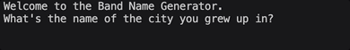

# Day 1 - Working with Variables in Python to Manage Data

## Concepts Learned/Practiced
- Printing to the Console
- String Manipulation
- The Python Input Function
- Python Variables
- Variable Naming

## Band Name Generator
