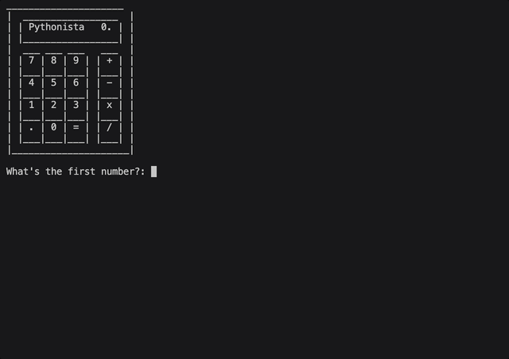

# Functions with Outputs

## Concepts Learned/Practiced
- Function with Outputs
- Multiple return values
- Docstrings
- Combining Dictionaries and Functions
- Print vs. Return
- While Loops, Flags and Recursion

## Calculator
