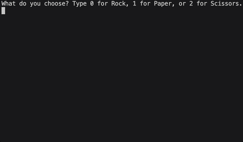

# Day 4 - Randomization and Python Lists

## Concepts Learned/Practiced
- Random Module
- Understanding the Offset and Appending Items to Lists
- Index Errors and Working with Nested Lists

# Rock Paper Scissors
