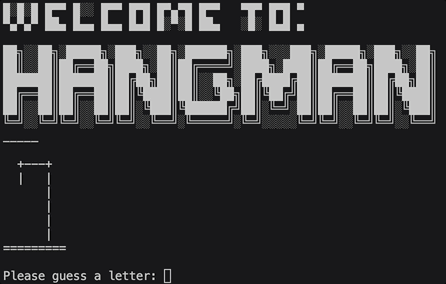

# Day 7 - Hangman

## Concepts Learned/Practiced
- How to break a Complex Problem down into a Flow Chart
- How to Check the User's Answer
- Improving the User Experience
- How to Add ASCII Art and Improve the UI

## Hangman
